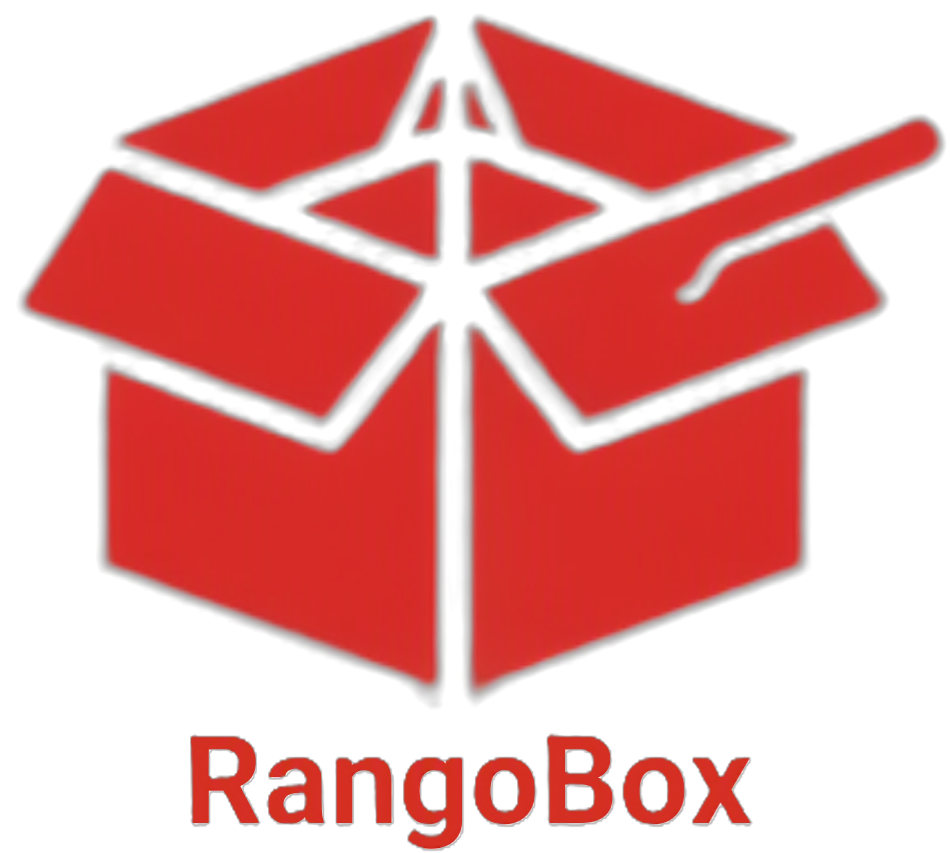

#  RangoBox

> Um ecossistema completo de delivery de comida projetado para aproximar clientes de seus restaurantes favoritos de forma rápida, intuitiva e com total flexibilidade de escolha.

---

## 💻 Sobre o Projeto

O **RangoBox** é uma aplicação de marketplace/delivery desenvolvida para facilitar o gerenciamento e a busca por refeições. O sistema conta com um ecossistema completo de administração, permitindo o gerenciamento dinâmico (CRUD) de categorias e produtos. 

Um dos grandes diferenciais da plataforma é o seu foco em inclusão alimentar, trazendo uma **ferramenta de busca integrada e filtros dedicados para produtos veganos e orgânicos**, facilitando a jornada de usuários que buscam hábitos de vida mais saudáveis e conscientes.

---

## 🚀 Funcionalidades Principais

*   **📦 CRUD de Produtos:** Visualização, cadastro, edição e exclusão de itens de forma simplificada.
*   **🏷️ CRUD de Categorias:** Organização estruturada dos cardápios e estabelecimentos.
*   **✨ Cadastro via Pop-up:** Criação e adição de novos produtos através de uma interface de modal fluida e moderna, sem necessidade de recarregar a página.
*   **🌱 Busca Inteligente:** Filtros dinâmicos projetados especialmente para localizar de forma instantânea opções **Veganas** e **Orgânicas**.
*   **📱 Interface Responsiva:** Layout elegante adaptado para dispositivos móveis, tablets e computadores desktop.

---

## 🛠️ Tecnologias Utilizadas

A stack do projeto foi selecionada para garantir robustez, tipagem segura e estilização ágil:

| Camada | Tecnologia | Utilidade |
| :--- | :--- | :--- |
| **Front-end** | [React](https://react.dev/) | Construção da interface declarativa e componentes reutilizáveis. |
| **Front-end** | [TypeScript](https://www.typescriptlang.org/) | Tipagem estática para maior segurança e prevenção de bugs em tempo de escrita. |
| **Estilização** | [Tailwind CSS](https://tailwindcss.com/) | Design utilitário rápido, responsivo e altamente customizável. |
| **Back-end (Simulado)** | [JSON Server](https://github.com/typicode/json-server) | API REST mockada para simulação real de requisições de banco de dados. |

---

## 📦 Como Rodar a Aplicação

Para executar o projeto localmente, você precisará ter o [Node.js](https://nodejs.org/) instalado em sua máquina.

### 1. Clonar o Repositório
```bash
git clone [https://github.com/Seu-Usuario-Ou-Organizacao/rangobox.git](https://github.com/Seu-Usuario-Ou-Organizacao/rangobox.git)
cd rangobox

### 2. Configurar o Back-end (JSON Server)
A API simulada do projeto roda em uma porta separada para simular a comunicação com um servidor real.

1. Instale as dependências gerais do projeto (caso não tenha instalado):
   ```bash
   npm install
   ```
2. Inicialize o JSON Server (por padrão na porta `5000` ou conforme configurado no seu `db.json`):
   ```bash
   npx json-server --watch db.json --port 5000
   ```

### 3. Configurar e Executar o Front-end
Com a API rodando, abra um novo terminal na raiz do projeto e execute:

1. Inicie o servidor de desenvolvimento do Vite:
   ```bash
   npm run dev
   ```
2. Abra o navegador no endereço indicado no console (geralmente `http://localhost:5173`).

---

## 📂 Estrutura de Pastas Principal

```text
rangobox/
├── public/                 # Assets públicos
├── src/
│   ├── components/         # Componentes globais (Navbar, Footer, Modais)
│   ├── pages/              # Páginas da aplicação (Cadastro, Home, etc.)
│   ├── services/           # Configurações de API (Axios)
│   ├── App.tsx             # Componente raiz com as Rotas
│   ├── main.tsx            # Inicialização do React
│   └── index.css           # Estilização global do Tailwind
├── db.json                 # Banco de dados simulado do JSON Server
├── tailwind.config.js      # Customização de tema do Tailwind
└── package.json            # Scripts e dependências do projeto
```

---

## 👥 Integrantes do Grupo

*   [Dayane Santana](https://github.com/dayanesantana) - Desenvolvedora Full-Stack
*   [Giovanna Mendes](https://github.com/GimendescCodes) - Desenvolvedora Full-Stack
*   [Jhonatan Oliveira](https://github.com/jhonatanoliveira18) - Desenvolvedor Full-Stack
*   [Isabella Rodrigues](https://github.com/isa01rodrigues) - Desenvolvedora Full-Stack
*   [Jackeline Gomes](https://github.com/jackeline5458) - Desenvolvedora Full-Stack
*   [Rafael Scherer](https://github.com/rafaelscherer3) - Desenvolvedor Full-Stack

---
<p align="center">Desenvolvido com ❤️ pelo Grupo 06 no Projeto Integrador.</p>